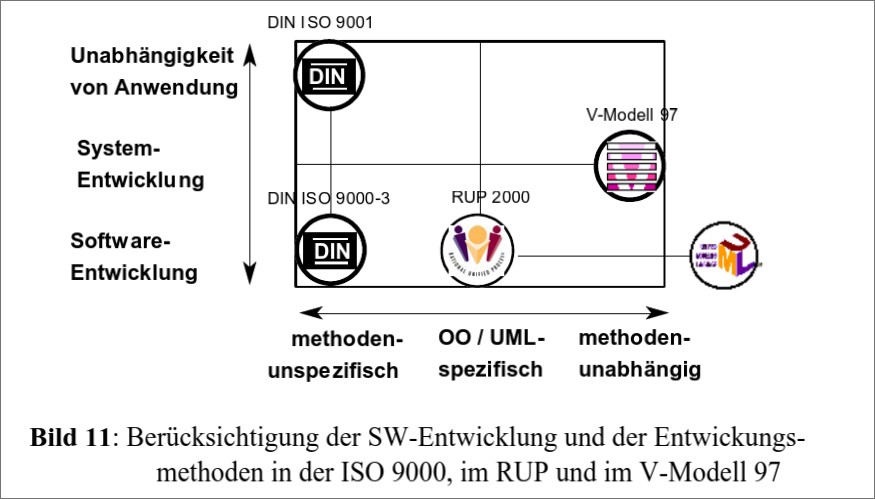
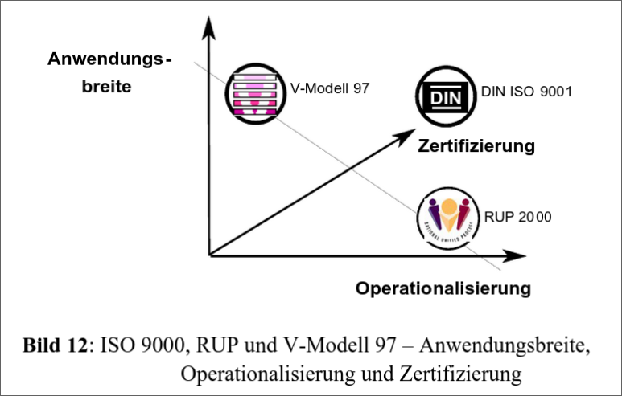
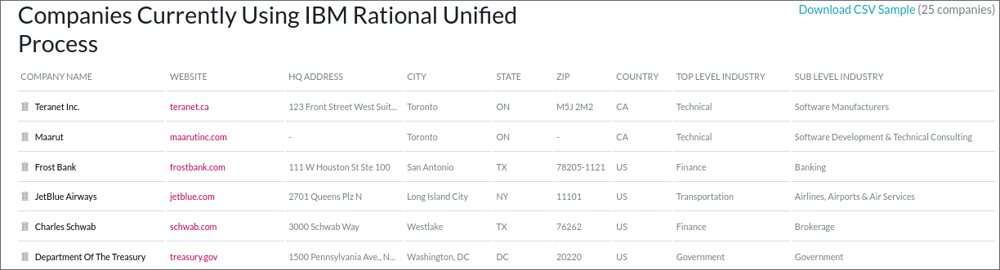

# Rational Unified Process (RUP)
#### Michael Stenz

---

## Agenda

- Geschichte & Entwicklung
- Wie funktioniert RUP?
- Statische Aspekte
- Phasen des RUP
- Vorteile & Nachteile
- Best Practices
- Prinzipien
- Fallbeispiel: E-Commerce-Plattform
- RUP vs. Agile

---

## Einleitung

- Iterativer und inkrementeller Softwareentwicklungsprozess
- Entwickelt von Rational Software (später IBM)
- Geeignet für große, komplexe Projekte
- Flexibel anpassbar an Projektbedürfnisse

---

## Geschichte & Entwicklung

- Entstehung in den 1990er Jahren
- Begründer: Ivar Jacobson, Grady Booch, James Rumbaugh ("drei Amigos")
- Übernahme durch IBM, aktuell RUP 9.0 (seit 2006)
- Integration von OOAD, UML und iterativer Entwicklung

---

---

## Wie funktioniert RUP?

- Iterativer Entwicklungsprozess mit regelmäßigen Releases
- Zyklischer Ablauf durch die vier Phasen:
  - Inception, Elaboration, Construction, Transition
- Laufende Feedbackschleifen und Anpassungen

---

## Statische Aspekte

- **Kernarbeitsschritte:**
  - Geschäftsmodell und Business Modeling
  - Anwendungsfallmodell und Requirements
  - Architekturentwurf & Design
  - Implementierung, Tests und Deployment

---

## Statische Aspekte

- **Unterstützende Disziplinen:**
  - Konfigurations- und Änderungsmanagement
  - Projektmanagement
  - Umwelt- und Qualitätsmanagement

---

## Phasen des RUP

- **Inception:** Projektinitialisierung & Planung
- **Elaboration:** Detaillierte Planung, Architektur und Risikomanagement
- **Construction:** Implementierung & kontinuierliche Tests
- **Transition:** Produktbereitstellung & Markteinführung

---

## Phase 1: Inception

- Kommunikation & Planung stehen im Vordergrund
- Erstellung eines Anwendungsfallmodells zur Anforderungsdefinition
- Abschätzung von Kosten, Zeit und Risiken
- Meilensteinprüfung als Entscheidungspunkt

---

## Phase 2: Elaboration

- Detaillierte Anforderungsanalyse und Modellierung
- Überarbeitung und Verfeinerung des Anwendungsfallmodells (~80% fertig)
- Aufbau einer ersten Architektur-Basislinie
- Identifikation und Bewertung von Risiken

---

## Phase 3: Construction

- Entwicklung und Umsetzung der Software
- Iterative Erstellung von Softwaremodulen
- Durchführung von Unit- und Integrationstests
- Regelmäßige Releases zur Fehlererkennung und Anpassung

---

## Phase 4: Transition

- Vorbereitung der Produktionsumgebung
- Durchführung von Beta-Tests und abschließenden Qualitätsprüfungen
- Aktualisierung der Projektdokumentation
- Schulung der Benutzer und Übergabe des fertigen Produkts

---

---

## Vorteile von RUP

- Ausführliche Dokumentation und strukturierter Prozess
- Effektives Risikomanagement
- Wiederverwendbarkeit von Komponenten reduziert Entwicklungszeit
- Gute Unterstützung durch Tutorials und Schulungen

---

## Nachteile von RUP

- Hoher Bedarf an Expertenwissen und Prozessverständnis
- Komplexität und hoher administrativer Aufwand
- Starke Abhängigkeit vom Risikomanagement
- Schwierigkeiten bei der Wiederintegration von Änderungen

---

## Best Practices im RUP

- **Inkrementelle Entwicklung:** Regelmäßige, funktionsfähige Releases
- **Anforderungsmanagement:** Einsatz von Use Cases und Szenarien
- **Modulare Architekturen:** Wiederverwendbarkeit und Flexibilität
- **Visuelle Modellierung:** UML-Diagramme zur besseren Kommunikation
- **Qualitätssicherung:** Umfassende Teststrategien
- **Änderungsmanagement:** Konsistente Verwaltung von Softwareänderungen

---

## Prinzipien des RUP

- **Architecture-Centric Approach:** Fokus auf eine robuste, skalierbare Architektur
- **Component-Based Development:** Wiederverwendung von unabhängigen Softwarekomponenten
- **Iterative & Incremental Development:** Frühzeitige Risikoerkennung und kontinuierliches Feedback
- **Use-Case Driven:** Anforderungen werden durch reale Anwendungsfälle definiert
- **Risk Management:** Proaktive Identifikation und Steuerung von Risiken

---

## Fallbeispiel: E-Commerce-Plattform

- **Projektziel:** Entwicklung einer umfangreichen Online-Verkaufsplattform
- **Inception:** Festlegung von Anforderungen, Risiken und Grundfunktionen (z.B. Warenkorb, Zahlung)
- **Elaboration:** Detailplanung, Architekturentwurf und Überarbeitung des Anwendungsfallmodells
- **Construction:** Modulbasierte Entwicklung, kontinuierliche Tests und Iterationen
- **Transition:** Produktionseinführung, Benutzerschulung und abschließende Qualitätssicherung

---

## RUP vs. Agile

- **RUP:**
  - Strukturiert, dokumentationsintensiv und phasenbasiert
  - Eher geeignet für große, komplexe Projekte
- **Agile:**
  - Flexibel, schnelle Iterationen, kontinuierliches Feedback
  - Ideal für dynamische, kleinere Projekte
- Entscheidung abhängig von Projektgröße, Anforderungen und Teamstruktur

---

---

---

## Wann RUP einsetzen?

- Große, komplexe Projekte mit hohem Qualitätsanspruch
- Notwendigkeit detaillierter Dokumentation und formaler Prozesse
- Projekte mit hohem Risiko und Bedarf an strukturiertem Risikomanagement
- Szenarien, in denen die Wiederverwendung von Komponenten zentral ist

---

---

## Zusammenfassung & Fazit

- RUP: Ein strukturierter, iterativer Ansatz zur Softwareentwicklung
- Gliederung in vier klare Phasen mit spezifischen Zielen
- Starke Dokumentation, Risikomanagement und Wiederverwendbarkeit
- Entscheidung zwischen RUP und agilen Methoden stets projektspezifisch

---

# Vielen Dank für Eure Aufmerksamkeit!

https://github.com/Stenz123/rup-itp-referat-2025/
https://stenz123.github.io/rup-itp-referat-2025/

---

## Quellen

- https://de.wikipedia.org/wiki/Rational_Unified_Process
- https://de.wikipedia.org/wiki/Rational_Software
- https://www.youtube.com/watch?v=uOnpFbQHXnc
- https://www.geeksforgeeks.org/rup-and-its-phases/
